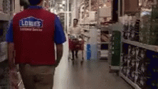

In diesem Blogpost geht es um Jan Böhmermanns Podcast "Fest und Flauschig", den AZOrult Trojaner, NetCologne, Kontakt zum BSI und eingen Internetsperrungen.
Das scheint im Zusammenhang keinen Sinn zu machen, wird es aber nach dem Lesen.

Über ein Jahr lang hat NetCologne mir meinen Internetzugang abgedreht.
Manchmal wenige Stunden, manchmal auch mehrere Tage.
Auch gerne mal übers Wochenende.
In total unregelmäßigen Abständen.
Mal war Monate alles okay, mal direkt ein paar Tage hintereinander.
Das macht dann auch besonders Spaß, weil ja mittlerweile alles übers Internet geht.
Selbst das Radio über den Smart Speaker.

Hier erfahrt ihr, wie ich mich gegen den Provider wehren musste, um meinen Internetzugang doch zu entsperren und warum Ich am Ende noch nicht mal Schuld war.

<!--more-->
---

An folgenden Tagen bekam ich eine SMS mit der Info, dass mein Internetanschluss gesperrt wurde.

* 24.05.2019 um 10:20 Freitag
* 17.06.2019 um 12:18 Montag
* 22.07.2019 um 12:34 Montag
* 09.09.2019 um 12:48 Montag
* 28.02.2020 um 12:34 Freitag
* 20.03.2010 um 13:40 Freitag

Die SMS Nachricht war immer gleich:

> NetColgone informiert: Ihr Internet-Anschluss ****** musste leider gesperrt werden.
> Bitte rufen Sie fuer weitere Informationen und zur Entsperrung das Portal http://schutz.netcologne.de auf. Ihr > Freischaltcode lautet *****

Ich habe mir beim ersten Mal nichts gedacht und habe einfach mal meinen Gaming PC zurückgesetzt.
Da ist wirklich nur Steam, Epic und Co drauf installiert.
Ging alles ganz fix.
Maleware, Viren und so kann man sich mit Windows halt schnell einfangen, auch wenn man ein wenig Ahnung hab.
Ich schließe mich da definitiv nicht aus.

Als ich die gleiche SMS wieder bekommen hatte, wurde ich ein bisschen stutzig und habe mal den NetCologne Support angerufen.

Herauszufinden, was der Grund der Sperre ist, war schonmal nicht so einfach.
Angeblich ein Virus oder Trojaner in meinem Netz.
Oft hieß es "AZORult" sei auf meinem System.

Mal sollte der AZORult auf der FritzBox sein, dann das Handy, dann mein PC oder man könne das ja gar nicht sagen.
Es wurde auch gefragt, ob ich eine TV Box aus dem Osten gekauft habe.
Da gab es wohl einen Fall, dass der AZORult vorinstalliert war.
Aber das war natürlich nicht der Fall.

Der Support konnte mir mit seinen sehr vielen gegensätzlichen Aussagen nicht gerade helfen.
Man hat definitiv gesehen, dass die meisten überhaupt keine Ahnung von Technik haben und nur das Supportskript durchspielen.

Ich hab nichts dagegen, wenn jemand etwas nicht weiß. 
Hey, das Internet und alles darum ist kompliziert.
Allerdings einfach zu Lügen oder sich Dinge auszudenken, um sich die Blöße nicht zu geben, dass man etwas nicht weiß, geht gar nicht.
Vor allem hat es mir die Arbeit erschwert herauszufinden, was das eigentliche Problem ist.

NetColgone hat mich dann darauf verwiesen, dass Sie selbst bei Virenbefall nicht helfen können.
Diese müssen nur den Anschluss sperren von dem aus der böse Traffic kommt. 
Sie haben mich auf einen Dienstleister verwiesen, der sich dem Thema spezialisiert hat.

## Gespräch mit Antiviren Spezialisten

Nachdem ich sehr viel selbst zum "AZORult" Trojaner Virus recherchiert habe und nicht viel finden konnte, habe ich die Antiviren Spezialfirma angerufen, die NetCologne für solche Fälle wohl nennt.

Der Herr am Telefon war super drauf und ich hab ihm meine Situation geschildert.
Angeblich AZORult, Windows Rechner schon platt gemacht.
Ich wollte wissen, was die denn machen würden, um den Trojaner/Virus zu finden.

Die würden das Gleiche machen.


Die stellen einfach jedes Gerät auf den Werkszustand wieder her und/oder installieren Windows neu.
Das kann ich auch nachvollziehen, denn wie soll man sicherstellen, dass der Trojaner wirklich weg vom System ist?
Pro Gerät kostet das dann einen pauschalen Betrag.

Das waren bei mir über 1000 €, da mehrere Rechner, Server, Raspberry Pis, Heimautomatisierungszeug, 2 Handys, etc. (Wobei ich kaum glaube, dass die meine Server und selbst geflashte IoT Geräte anfassen würden)

Das war mir wirklich zu blöd so viel Geld auszugeben, wenn ich das auch selbst sehr schnell machen kann.

Ich will die Dienstleistung nicht kleinreden.
Die macht sicherlich in vielen Fällen absolut Sinn, allerdings konnte mir bis zu dem Zeitpunkt noch niemand definitiv sagen, wie ich diesen Trojaner nur identifizieren kann.
Da diese Sperrungen auch sehr sporadisch auftraten, war ich mir sehr sicher, dass NetCologne mir das Internet fälschlicherweise sperrt.
Vor allem je länger sich diese Geschichte ziehte.

Am 04.03.2020 bekam ich dann auch einen Brief von NetCologne, der das ganze Thema nochmal zusammenfasste. 

## Brief von NetCologne - Den Virus kann man nicht mit gängigen Mitteln finden, bitte beweisen Sie das

Ich zitiere mal die interessanten Passagen:

>"In Ihrem Fall handelt es sich um den "azorult" Viruls.
>Dieser lässt sich von gänigngen Antivirus Programmen **NICHT** finden.
>
>[...]
>
>Bitte beachten Sie, dass die wiederholte Sperre des Internetzugangs die Entsperrung **nur mittels Nachweis >eines Logfiles einer geeigneten Reinigungssoftware** vorgenommen werden kann, aus dem die Bereinigung >hervorgeht.
>Eine telefonische Bestätigung können wir nicht mehr akzeptieren."




Moment mal.
Erst steht dort, dass man diesen Trojaner nicht aufspüren kann und dann soll ich noch beweisen, dass ich diesen entfernt habe?
Selbst die Firma spezialisiert auf Virenentfernung würde den PC nur plattmachen und kann nichts finden.
Das hab ich zu dem Zeitpunkt allerdings schon mehrmals gemacht.

Mir wurde das Internet ja sogar mehrfach über das ganze Wochenende gesperrt.
Da hab ich mir auch am Anfang die Zeit genommen, mit der [Desinfec't vom Heise Verlag](https://www.heise.de/download/product/desinfect-71642) jeden PC (Windows, Mac und Linux) mal zu prüfen.
Natürlich habe nichts gefunden.

{}
Zudem ging es auch irgendwann 2020 mit Corona los.
Mein damaliger Arbeitgeber hat auch sehr gut reagiert und es sollten so viele wie möglich von zu Hause aus arbeiten.
Das geht auch super in der IT Branche, nur braucht man halt Internet.
{}

Aber mit dem Schreiben stiehlt NetCologne sich schön aus der Verantwortung und will auch keinerlei Beteiligung am Problem.

Am Telefon haben dann auch einige Support Mitarbeiter gesagt, dass ich auf jeden Fall eine Rechnung von einem Antivirenspezialisten vorlegen muss, um das Internet wieder freizuschalten, falls das nochmal passieren sollte.

Ich habe dem Support klargemacht, dass diese Spezialfirma den AZORult auch nicht finden kann und in meinem Fall ~1000 € bezahlen müsste.
Das sei dann aber einfach mein Problem und NetColgone könnte dafür ja nichts.

Wahnsinn, wie viel Hilfe NetCologne hier einem Kunden anbietet, das Problem zu lösen.
Keine.
Einfach behaupten, dass der Virus nicht erkannt werden kann, aber dann sagen, dass man ein Logfile als Beweis braucht.

## Wer hat denn Schuld und wie finde ich das raus?

Die Situation im Allgemeinen ist für den Kunden schlichtweg eine Karre Mist.
NetCologne als Provider ist verpflichtet Anschlüsse zu sperren, die unerwünschte Aktivitäten nachgehen.
Kann einem aber selbst nicht sagen, was genau das Problem ist und als Kunde sitzt man in der Mitte.

Wer bestimmt, dass es sich bei diesem Traffic um "bösen" Traffic handelt?
Zum einen das BSI.
Denn die prüfen, ob man von zu Hause aus zum Beispiel Spam verschickt, da man einen schlecht konfigurierten Server bei sich stehen hat.
Oder ob man bestimmte Command and Control Server anspricht.
Aber es gibt auch Dritte, also irgendwelche Firmen, die diese Aktivitäten prüfen und dann die Info an die Provider weitergeben.

{}
Grober Exkurs zu Command and Control Server:

Command and Control Server werden in Botnetzen genutzt.
Zum Beispiel kann eine Schadsoftware von einem PC diesen dann ansprechen und der C&C Server sorgt dann für nähere Instruktionen, wie das Herunterladen und Installieren von Trojaner Software.
Wer diese Server anspricht (das sieht das BSI und andere Firmen) ist mit hoher Wahrscheinlichkeit mit dem jeweiligen Virus/Trojaner infiziert.
{}

Der Provider sperrt dann einfach, bei Erhalt der Info.

Ein Problem war auch, dass ich nicht wusste, wann denn die angebliche "böse" Aktivität in meinem Netz passiert.
Bisher hatte der Telefonsupport immer gemischte Aussagen darüber, ob die "böse" Aktivität zum Zeitpunkt der SMS passiert ist oder ob diese etwas Zeitversetzt sei.

Das war interessant und ich hab schon vor dem Brief (weiß ich nicht mehr genau wann) mit dem NetCologne Support Kontakt gehabt, die etwas technisch versierter waren.
Dort sagte mir man, dass die SMS viel später bei mir ankommt, als der eigentliche Fall mit dem AZORult erkannt wird.
Wir reden hier von bis zu einer Woche (da bin ich mir nicht mehr sicher, es waren aber definitiv mehrere Tage).

Gut, die SMS an sich hilft dann gar nicht, allerdings hab ich ein Log bekommen, zu welchem Zeitpunkt genau die "bösen" Aktivitäten stattfanden und zu welcher Ziel IP die gingen:

Das Logfile sah ungefähr so aus und mit UTC als Zeitzone:

```shell
timestamp   ip_addr asn   port  proto  confidence   cc   notes  category    family
2020-03-19 05:58:14   ***.***.***.***  8422  41003  6    50   DE   destaddr: ***.***.***.***/32; destport: 80    bot   AZORult
```

NetColgone kann mir nur sagen, dass der Traffic von meinem Anschluss kam und wohin dieser ging.
Leider konnten die nicht sagen, welches meiner Geräte diesen Traffic erzeugt hat.
Zumindest ist das bei IPv4 so wegen NAT, bei IPv6 wäre das vielleicht ein wenig einfacher, da kein NAT gemacht wird.
Allerdings gibt es da auch die temporären Adressen und Naja egal, hier war es halt IPv4.

## Die Beweislast umkehren

Da NetCologne alles andere als eine Hilfe ist und das Support-Personal leider zu 90 % komplett keine Ahnung hat, musste ich mir überlegen, wie ich das Problem löse.

Selbst mit meinen Arbeitskollegen waren wir mittlerweile Ratlos, was das sein könnte.
Haben einige Mittagstische mit dem Thema füllen können :smile:

Ich entschied mich dazu, irgendwie etwas zu bauen, welches meinen GESAMTEN Traffic mitschneidet.

Erst wollte ich mir ein Gerät holen, welches den Traffic an der FritzBox spiegelt oder einfach nen Geräte zwischen FritzBox und allen meinen Geräten per Kabel schalten.
Nachteil dabei, WLAN wäre außen vor.

Dann hab ich aber herausgefunden, dass man den Traffic an der FritzBox direkt tcpdumpen kann!
Und natürlich hat das jemand schonmal gemacht gehabt.
Super, ein wenig Arbeit gespart.

Also ein Raspberry Pi rausgekramt und eine alte 500 GB Festplatte angeklemmt.



Dann hab ich stündlich das Script alle Daten der FritzBox dumpen lassen.
Zum Test hab ich mir diese dann mal mit Wireshark am Rechner angeschaut und ich konnte somit auch die Source IP sehen.
Cool.

Das heißt, wenn ich das nächste Mal von NetCologne gesperrt werde, kann ich die nach der Ziel IP fragen, die mein Anschluss angesprochen hat.
Die nennen mir dann auch den Zeitraum im Log.
Mit dem Zeitraum finde ich die richtige Datei und mit der Ziel IP kann ich herausfinden, von welchem Gerät den der Traffic gesendet wurde.

Wer Interesse hat, findet hier das Gist dazu auf Github, ich hab leider vergessen, von wem ich das kopiert und angepasst habe.

https://gist.github.com/ajfriesen/784ec148e26d2d20f73888d0fe054e80



## Erwischt

Am 20.03.2020 sitze ich im Home-Officeund halte gerade eine kleine Team interne Schulung.
Plötzlich flieg ich aus Microsoft Teams raus.
Dachte mir nichts.
Der Linux Client ist alles andere als knorke und hab gewartet.
Bis ich dann verstanden hab, dass mir NetCologne schon wieder das Internet abgedreht hat!
Die Sperr SMS kam dann auch um 13:40.

Ich habe sofort die IP bei abuse@netcologne.de angefragt.

Die IP-Adresse mit dem Timestamp kam sofort.


> Hallo Herr Friesen,
> 
> Im folgenden senden wir Ihnen den aktuellen Log zu der Vireninfektion.
> 
> Der Zeitstempel im Log ist in UTC angegeben.
> 
> Log:
> 
> timestamp   ip_addr asn   port  proto  confidence   cc   notes  category    family
> 2020-03-19 05:58:14   89.0.116.134  8422  41003  6    50   DE   destaddr: 145.14.144.114/32; destport: 80    bot   AZORult
> 
> 
> 
> Mit freundlichen Gruessen,
> 
> NetCologne Abuse Team <abuse@netcologne.de>


Durch den Zeitstempel und der Destination IP konnte ich mit Wireshark dann das Gerät ausfindig machen.

Es handelt sich um das Nokia 6.1 meiner Freundin.
Aktuelles Android 10 mit aktuellem Patch Level.
Kein root oder andere Appstores installiert.

Daraufhin habe ich NetColgone informiert, dass ich das Gerät identifiziert habe.
Außerdem versicherte ich, das das Gerät erstmal nicht ins WLAN kommt.
NetColgone bestätigte mir, dass Sie bald das Internet wieder freischalten würden.

Tja... wieder ein Wochenende ohne Internet.
Ist ja nicht so, dass ich für die Dienstleistung bezahle.

## Jetzt kommt das BSI

Das Handy habe ich mal mit Handy Antiviren gecheckt und da schien auch alles okay zu sein.
Soweit man das sagen kann.

Dann dachte ich mir: ich frage mal das BSI, was die von dem bösen Traffic halten, da ich nur grundlegende Sachen mit Wireshark hinbekomme.
Bin halt nicht der Netzwerk- und vor allem nicht Maleware Profi.

>Sehr geehrter Herr Friesen,
>
>vielen Dank für Ihre Anfrage.
>
>Das Schadprogramm AZORult ist nur auf Windows lauffähig, nicht auf Android.
>
>Das BSI informiert Netzbetreiber in Deutschland täglich zu (vermuteten) Schadprogramm-Infektionen in den >jeweiligen Netzen. Provider werden gebeten, Ihre betroffenen Kunden entsprechend zu informieren.
>
>Weitere Informationen zu diesem Verfahren finden Sie auf <https://reports.cert-bund.de> unter Reports / >Schadprogramm-Infektionen.
>
>Jeder vom BSI an die Netzbetreiber gemeldete Datensatz enthält die betroffene IP-Adresse, einen Zeitstempel >sowie weitere Informationen wie z.B. den Namen des Schadprogramms.
>
>Nur die Provider können zuordnen, welcher Kunde die von uns gemeldete IP-Adresse zu dem angegebenen Zeitpunkt >verwendet hat. Um dem Sachverhalt weiter nachgehen zu können, benötigen wir die genauen IP-Adressen und >Zeitstempel, die Ihnen von NetCologne gemeldet wurden.
>
>Bitte senden Sie diese Angaben direkt an certbund@bsi.bund.de

Daraufhin habe ich den relvanten Traffic und meine Erklärung zum Fall geschildert.
Der Mitarbeiter vom BSI hat mir erklärt, wie ich mit Wireshark herausfinde, was wirklich vorgefallen ist und nach ein wenig hin und her gabs dann diese Antwort:

>Hallo Herr Friesen,
>
>unter fibu.000webhostapp.com wurde wohl zuvor ein RSS-Feed zum Podcast "Fest & Flauschig" bereitgestellt.
>
>Dieser wurde jedoch inzwischen gelöscht und der Host fibu.000webhostapp.com
>löst vermutlich daher jetzt auch zu einer anderen IP auf.
>
>000webhostapp.com bietet freies Webhosting an.
>Dieser Dienst wird von AZORult missbraucht, um dort Konfigurationsdaten für
>das Schadprogramm unter wechselnden Hostnamen zu hinterlegen.
>Durch das Shared-Hosting lösen dann jedoch viele Hostnamen zu identischen IPs auf.
>
>Meine Vermutung ist, dass es sich daher hier um einen False Positive handelt:
>Sie haben auf einen Hostnamen unter 000webhostapp.com zugegriffen, unter dem legitime Inhalte angeboten >wurden, ein anderer von AZORult verwendeter Hostname auf 000webhostapp.com löste jedoch zu der identischen IP >145.14.144.114 auf.
>
>Ich werde NetCologne bitten, mit der Quelle der dort zugelieferten Daten zu prüfen, wie die Erkennung genau >abläuft und False Positives vermieden werden können.

Halten wir fest:

**Jan Böhmermann mit seinem Podcast Fest & Flauschig ist schuld, das ich seit einem Jahr dauernd das Internet gesperrt bekomme.**

Spaß beiseite.
Meine Freundin und ich waren erstmal erleichtert, dass es nicht ihr Handy war.

Und ich war erleichtert, dass ich ÜBERHAUPT GAR NICHT SCHULD war.
So gar nicht.

Vor allem: Wer prüft denn heute bitte auf bei sowas auf IPs?
Es gibt schon so lange so etwas wie Loadbalancer, virtual Hosting, virtual IPs, etc.
Man kann heutzutage und auch schon seit langer Zeit nicht davon ausgehen, dass eine IP einen Host hat...

## Aufklärung

Seit dem Mailverkehr mit dem BSI ist lange nichts passiert.
NetCologne hat sich bei mir nicht gemeldet, ich hab aber öfter im Support angerufen, da konnte man mir aber nicht helfen.
Man landet leider immer im Support und das ist halt Hölle, weil man JEDES mal die Story erklären muss und 90 % derjenigen die dort sitzen, haben leider nichts verstanden.

Ich wollte von NetCologne jetzt einige Dinge:

* eine Entschuldigung
* sicherstellen, dass das nicht nochmal passieren würde
* eine Entschädigung
* meine Sperrstufe runterstellen
* Eventuell ein Upgrade meiner Leitung (das war mir ehrlich gesagt nicht so wichtig, da ich zufrieden mit der 100 Down und 50 Up war. Eventuell 200 Down, aber wie gesagt optional)

## NetCologne entschuldigt sich

Irgendwann hat sich bei mir das Beschwerdemanagement gemeldet und wir sind diesen Fall durchgegangen.

Die Entschuldigung sah so aus:



Ich nehme mal an das **"nicht"** ist ein Fehler, denn sonst würde NetCologne sich ja nicht bei mir entschuldigen wollen.
Ich mein wir sind alle Menschen und machen Fehler, aber zu dem Zeitpunkt hat mich dieses Schreiben aufgeregt.
Mein Gedanke war sofort: "Können die nicht einmal etwas richtig machen?".

Das ist auch der Grund, warum ich das ganze einiges später zusammenfasse, um ein bisschen nüchterner darüber zu berichten :wink:

Auf das Entschuldigungsschreiben wollte ich dann wissen, wie die auf den Betrag von 50 € kommen und ob NetCologne das wirklich ernst meint.
Die Geschichte ist jetzt schon über ein ganzes Jahr im Gange.
Ich weiß echt nicht wie viele Wochenenden und generell Zeit ich damit verschwendet habe.

Weiterhin wollte ich sicherstellen, dass mir und vor allem anderen (technisch nicht so versierten) das nicht nochmal passieren kann.
Ich wollte wissen, was für Maßnahmen ergriffen werden.

Man stelle sich nur mal vor das wäre jemanden passiert, der wirklich keine Ahnung hat.
Im schlimmsten Falle hätte die Person mehrfach die Antiviren Firma bezahlen müssen, den Laptop platt zu machen und dann wäre es trotzdem immer wieder passiert.

Zuletzt wollte ich, dass meine Sperrstufe runtergestuft wird.
Die Sperrstufe (so hab ich das vom Support verstanden) definiert, wer einen Kunden entsperren darf, falls dieser gesperrt war.
Das System hat mich als hoch eingestuft, sodass ich mich nicht mehr selbst entsperren kann.
Das geht binnen weniger Minuten und dann hätte ich wieder Internet.
In meinem Fall ist es aber so, dass nicht ich und auch nicht der normale Support mehr dran dürfen.
Da war einfach eine weitere Eskalationsstufe drin und die hat auch dafür gesorgt, dass ich am Freitag mein Internetzugang nicht mehr freigeschaltet bekomme, weil die Damen und Herren halt nicht so lange arbeiten wieder Support.

Aber auf diese Fragen und Forderungen hat NetCologne allerdings lange nicht reagiert und ich wusste nicht, ob die mir wieder das Internet sperren können aufgrund des False positives.

## Vitamin B - kölsche Klüngel

Nach einigen Wochen stillstand kam dann meine Freundin auf mich zu und meinte, Sie kennt einen Anwalt der bei NetCologne arbeitet.
Eventuell könnte der ja intern Prozesse anstoßen, dass wir Gewissheit bekommen, dass auch etwas gemacht wurde.

Mit dem Kontakt zum internen Anwalt ging dann alles plötzlich ganz schnell.

Ich bekam erstmal die Info, dass sich 2 Techniker um das Thema kümmern und definitiv sicherstellen, dass das nicht nochmal passiert.
Leider kam ich an keine Details über was genau, aber das kann ich auch teilweise verstehen, da es Betriebsinterna sind.
Haken dran, dass das nicht nochmal passiert.

Ich bekam einen Anruf, bei dem es um die Sperrstufe ging.
Nach Erläuterung des Problems wurde die Sperrstufe dann relativ schnell wieder runtergesetzt.
Super netter Herr der sich sehr verständlich zeigte und alles unkompliziert organisierte.

Zwischenzeitlich meldete sich die Kundenrückgewinnung bei mir.
Dem Sales-Mensch war das alles herzlich scheiß egal und war auch noch sehr unfreundlich zu mir.
Der wollte wohl einfach seinen soll schaffen und sich nicht mit so einem Sonderfall bemühen.
Während der Zeit schrieben der Anwalt uns hin und her.
Nachdem ich das dann gemeldet hatte, kam man auf mich mit einem Angebot zu, welches meine Situation berücksichtigte.
Zu dem Zeitpunkt hatte ich eine 100 Down und 50 Up Leitung über Kabel.
Ich hab dann mehrere Optionen bekommen mit Rabatt und da ich nicht gleich 1 GB brauche, bin ich auf 250 Down und 50 Up gekommen.
Ich kann gerade keinen Vergleich machen, da es den Tarif nicht mehr Online gibt.
Aber ich zahle momentan 36,   pro Monat bekomme auch was drauf steht und bin zufrieden, wie die Jahre davor.
Bis auf diese kleine Geschichte hier.

Weiterhin gab es zu der 50 € Gutschrift noch eine 500 € Gutschrift.
Ob das jetzt fair ist oder nicht sei mal dahingestellt.
Für mich war das okay und die Gutschrift reicht für ein bisschen mehr als ein Jahr Internet.
Das ist ja auch die ungefähr die Zeit, die ich in diese Thematik reinstecken musste.
Außerdem wollte ich das Thema für mich endlich mal abschließen.

Ich habe mich dann nochmal bei dem internen Anwalt bedankt und seitdem habe ich auch keine Probleme mit Internetsperren mehr.
Ich kann es nicht mehr ganz zuordnen, wann und mit dem ich gesprochen habe, aber von NetCologne Seite hat man sich bei mir auch bedankt, da ich maßgeblich dazu beigetragen habe, dass diese False Positives der Internetsperrungen in diesen konkreten Fall nicht mehr auftauchen.

## Ende gut alles gut

Das Ganze ist jetzt schon ein wenig her, aber da ich das doch sehr interessant fand, dachte ich, dass ich das mal zusammenschreibe.
Finde ich das NetColgone ein schlechter Anbieter ist?
Auf keinen Fall!

Ich denke, das Problem liegt in den internen Prozessen für den Support und würde genauso gut auch bei jedem anderem ISP (Internet Service Provider) passieren.
Sobald etwas nicht in die Standardfälle passt, ist diese Supportschleife durch den First Level Support für jemanden mit technischer Kompetenz einfach die absolute Hölle.
Man muss jedes Mal einer neuen Person den Fall schildern und fängt hunderte Male von vorne an.





Ich hoffe NetCologne hat durch diesen Fall etwas intern an den Prozessen geändert und vor allem, dass ich nicht nochmal zu einem Sonderfall werde.
Das war echt viel Zeitaufwand und hat mich jede Menge nervend gekostet.

Als ISP kann ich NetCologne trotzdem echt empfehlen, da der Anschluss echt super ist.
Trotz Kabel, dass ja ein geteiltes Medium ist, bekomme ich immer das, was ich bezahlt habe (größten Teil der Zeit).
Selbst seit Corona und meinen Remote Job ist auch alles wirklich super.
Man bekommt auch brav eine IPv4 und IP6.
Man kann seinen eigenen Router mitbringen und das einfach über das Webinterface einstellen und die FritzBox lässt sich super einfach in dem Bridge Modus bedienen, sodass man seinen eigenen Router hinter dem Kabel Modem betreiben kann.
Dazu eventuell in einem anderen Artikel mehr.

Vielen Dank an diejenigen, die sich diesen Block wirklich durchgelesen haben.

## TL;DR

Für die faulen unter uns:

1. NetCologne sperrt über ein Jahr unregelmäßig mein Internetzugang
2. Musste selber beweisen, dass der Traffic aber total okay war (Mehrere Tage Traffic mit einem Raspberry Pi Mitschneiden)
3. Habe das BSI eingeschaltet welche mir recht gaben
4. Der Traffic war der RSS Feed vom Podcast "Fest und Flauschig" von Jan Böhmermann
5. Durch Vitamin B konnte ich dann alles klären
