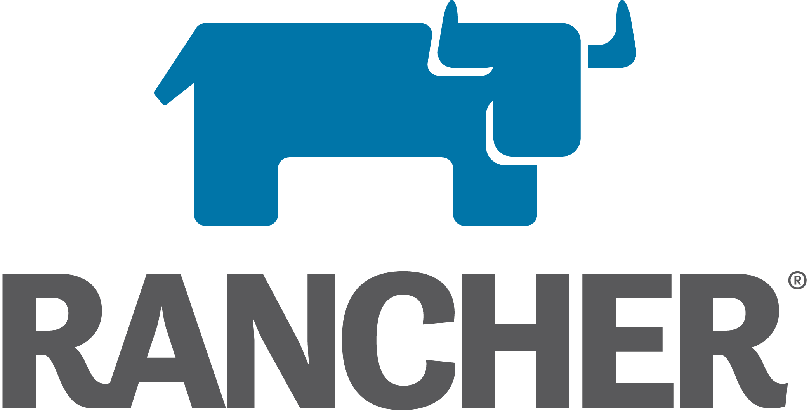

I have worked with Kubernetes the last 2 years on AWS with Rancher2 and just want to jot down some notes.
Tt is not only Kuberntes you need it is a whole ecosystem of tools.  
I would have found this kind of ressource helpful when I started so maybe this will be to you.

My experience is based mostly on AWS and Rancher2 since at that time EKS was not around.
So I will focus on the tools I know but maybe mention other alternatives.

# Rancher

I have started with Rancher2 back then when it was annacounced as GA.
The documentation was somewhat not existend but somehow we got it to work anyway and it is quite good as far as I concern.

Rancher2 is a little much, when you just want to create a Kubernetes cluster.
If you want that you can use several tools to create a cluster like

- [kops](https://github.com/kubernetes/kops)
- [kubeadm](https://kubernetes.io/docs/setup/production-environment/tools/kubeadm/install-kubeadm/)
- [kubicorn](https://github.com/kubicorn/kubicorn)
- [rke (Rancher Kubernetes Engine)](https://github.com/rancher/rke)

## rke - Rancher Kubernetes Engine

rke is just another method to install and maintain you Kubernetes cluster in the rancher opinioated way.
There are a lot of configuration options, check the rancher [rke docs](https://rancher.com/docs/rke/latest/en/) for more information.

rke will give you a kubernetes cluster to work with and not the rancher webinterface!
This is sometimes confusing, when you did not work with rancher before.

## Rancher2

Rancher itself is the Rancher API and Webinterface which you often see in the internet when someone is referring to rancher.

Rancher will run on top of your Kubernetes cluster created by rke.
You can depoly rancher via helm to that first rke cluster you created.

Here is the [Rancher Helm Chart](https://github.com/rancher/rancher/tree/master/chart) and the according documentation on the rancher website [Install Rancher on the Kubernete Cluster](https://rancher.com/docs/rancher/v2.x/en/installation/k8s-install/helm-rancher/)

So now you have a Kubernets cluster with the rancher 2 helm chart deplyed on to.
This Cluster should not be used as a Cluster for workloads.
It is the management Cluster frome where you can deploy as many cluster as you like to what location you like.

### Rancher Management Cluster and deployed cluster networking

As always I am only covering AWS here.

The rancher management cluster is running in a VPC.
The cluster you want to create needs another VPC.
That is something you have to take care of by yourself.
Rancher will not create the networking for you.

You can create the requirement network infrastructure with the AWS Console but I would recommend to go with AWS Cloudformation or terraform.

What you need:

- VPC for rancher mangement cluster
- VPC for rancher created kubernetes cluster
- VPC peering between those 2 VPS

Why do you need the peering?
Rancher will ssh into each node and will do the provisioning for each Kubernetes node.
Also there are some containers running in each created rancher Kubernetes cluster which will ping back to rancher for health checks.

### Rancher vocabulary

Now you have your rancher management cluster running you are ready to go to create you clusters with your cloud provider of choice and which is supported.

I will focus on AWS and on EC2 based clusters since that is what I have experience with.
But this vocabulary is more or less the same for every other provider.

#### Cloud Credentials

Cloud Credentials is just an AWS Access Key and Access Secret.  
**Do not use your user bound AWS credentials!**

What will happen, when you deploy your Kubernetes Cluster with the credials from a user and they leave the company?

1. You will deactiavate the aws account because of offboarding
2. Suddenly the cluster does not have proper credentials to interact with the AWS API anymore
3. Finding out will take you some time and can have bad effects like nodes not comming up in AWS

Why do I know that?
It is called experience ;-)

#### Node Templates

Node Templates are just what it says.
You define the ssh 

#### 

## Features Rancher will give you:

- User management, since Kubernetes does not have user management backed in.
- A neat webinterface to browse your clusters (yes, I mean several clusters!)
- One place to manage a lot

## Rancher Terraform Provider

### RKE Terraform Provider

# Grafana

# prometheus

## alertmanager

# cloudwatch-exporter

# fluentd-cloudwatch

# nginx-ingress controller

# kube-state metrics

# metric-server

# cert-manager

# kube2iam

# Helm