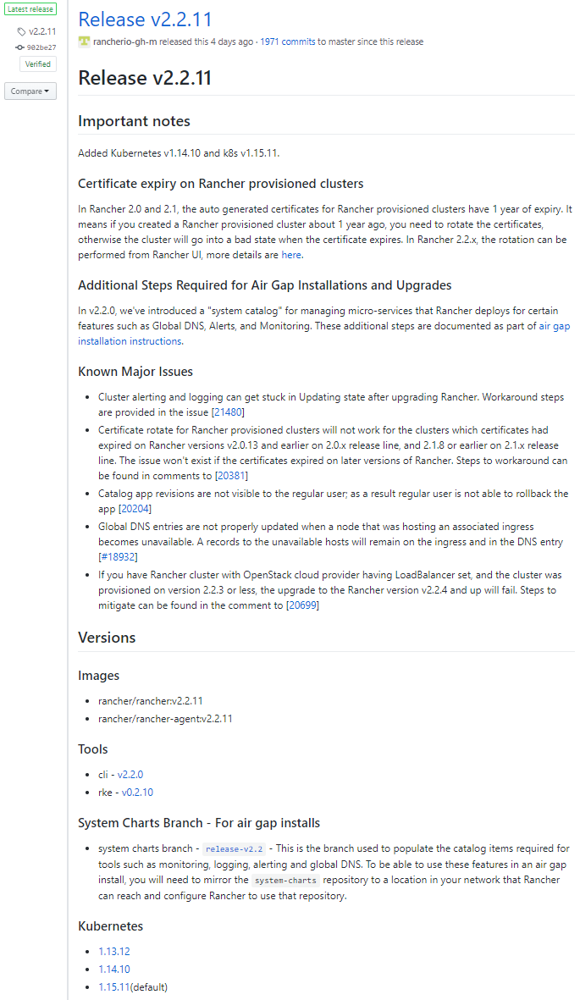

{}

## Rancher

Rancher is a Kubernetes distribution build by Rancher Labs.
There are some others like OpenShift from Red Hat with different features.

The distribution will run Kubernetes in an opinionated way so you do not have to think of every detail.

Example:

Kubernetes does not come with a user management system.
You could implement this your own or just pick a distribution which has done all the work for you.
Rancher comes with different authentication providers like Github, Azure AD and others.
It is baked in.
Just configure the authentication in Rancher, OpenShift or your Kubernetes distribution of choice and that is it.

Since it is opinionated it may not fit your use case.
Maybe you just need to dig a little deeper into the configuration options that depends on your needs.

Features Rancher will give you:

- User management, since Kubernetes does not have user management backed in
- A neat web interface to browse your clusters (yes, I mean several clusters!)
- Provision to major cloud providers (AWS, Google, Azure), bare metal, vmware vSphere etc.
- Kubernetes Cluster backups, upgrades, etc
- One place to manage a lot

Listing all features of Rancher does not make sense here.  
I just want you to know, that all lot is taken care of and that is the real reason to choose a Kubernetes distribution.
This is basic and important stuff which you would need to implement by yourself.
Pick your flavor and go with it like Linux distributions :wink:.

## rke - Rancher Kubernetes Engine

Rancher2 is the shiny web interface and API everybody talks about.
rke is the Kuerbetes installer which you use to create Kubernetes clusters with when using Rancher. 

It is rke which does the magic in Rancher.
Rancher is packed with a certain version of rke.
If you just want a Kubernetes Cluster to play with you can use several tools like:

- [kops](https://github.com/kubernetes/kops)
- [kubeadm](https://kubernetes.io/docs/setup/production-environment/tools/kubeadm/install-kubeadm/)
- [kubicorn](https://github.com/kubicorn/kubicorn)
- [minikube](https://github.com/kubernetes/minikube)
- [rke (Rancher Kubernetes Engine)](https://github.com/rancher/rke)

rke is just another method to install and maintain you Kubernetes cluster in the rancher opinionated way.
There are a lot of configuration options.
Check the rancher [rke docs](https://rancher.com/docs/rke/latest/en/) for more information.

rke will give you a Kubernetes cluster to work with but not the rancher web interface!
This is somewhat confusing, when you just start.

You can always see which Rancher version uses which rke version and therefore the support of the Kubernetes version in the [rancher/rancher repo](https://github.com/rancher/rancher/releases/)

Here you can see that [rancher v2.2.11](https://github.com/rancher/rancher/releases/tag/v2.2.11) uses [rke v0.2.10](https://github.com/rancher/rke/releases/tag/v0.2.10) and supports up to these Kubernetres version:

- 1.13.12
- 1.14.10
- 1.15.11

A good overview for support and all the versions about rancher can be found in their docs: [Rancher Support Matrix](https://rancher.com/support-maintenance-terms/all-supported-versions/rancher-v2.3.2/)

## Rancher2

Rancher itself is the Rancher API and web interface which you often see on the internet when someone is referring to Rancher.

Rancher will run on top of your Kubernetes cluster created by rke.
You can deploy rancher via helm to that first rke cluster you created.

Here is the [Rancher Helm Chart](https://github.com/rancher/rancher/tree/master/chart) and the according documentation on the rancher website [Install Rancher on the Kubernete Cluster](https://rancher.com/docs/rancher/v2.x/en/installation/k8s-install/helm-rancher/)

So now you have a Kubernetes cluster with the rancher 2 helm chart deployed on to.
This Cluster should not be used as a Cluster for workloads.
Since Rancher comes with rke you can now deploy as many cluster as you like to what location you like.

## Rancher Management Cluster and User Cluster Example

Rancher/rke will not take care of your general AWS infrastructure like networking.
This needs to be taken care of by yourself.
I would recommend to go with terraform but AWS Cloudformation and the AWS Console will work as well.

The first thing you need is a network and nodes to install a Kubernetes cluster with rke.
It would look like Figure 1:



There is a lot missing like Internet Gateways, NAT Gatways, routing tables, routes and you could use an Application LoadBalancer instead the Network LoadBalancer.
But you get the idea.

Next you would need to install Rancher to that Kubernetes cluster which is running on the 3 Rancher nodes.
After some DNS configuraton and certificates you have have a Rancher 2 web interface and API reday to go.

Easy right?
Yeah I know it is a lot of work.
So let´s go on.

Now you can use the Rancher2 web interface to create your cluster right?

**Wrong!**

We first need another VPC to deploy the Rancher user cluster into.
It is mostly the same setup as before but you need a VPC Perring (VPC Gateway is also possible) and you do not need to place EC2 nodes into the cluster.
That will be taken care of Rancher.



Why do you need the peering?
Rancher will ssh into each node and will do the provisioning for each Kubernetes node.
Also the created Kubernetes cluster will ping back to Rancher for health checks.

## Rancher vocabulary

To create the actual user cluster you need to know how Rancher will create those.
For that I will explain briefly what Rancher resources you need for the user cluster:

| Word                | Description                                                                        |
|---------------------|------------------------------------------------------------------------------------|
| `rke`               | rancher kubernetes engine. A tKubernetes installer in the rancher way. |
| `rancher`           | Rancher API and web interface..                                                     |
| `Cloud Credentials` | Credentials to your provider (AWS, Google, Azure, etc.).                           |
| `Node Templates`    | Definition of Node. Networking, Instance Type, Image, etc.                         |
| `Node Pool`         | Mapping between Node Role and Node Template when creating a User Cluster.          |
| `Node Role`         | Worker, etcd and Control Plane roles for Kubernetes                                |
| `User Cluster`      | The Cluster created for your actual workload                                       |
****

### Cloud Credentials

Cloud Credentials is just an AWS Access Key and Access Secret.  
**Do not use your user bound AWS credentials!**

What will happen, when you deploy your Kubernetes Cluster with the credentials from a user and they leave the company?

1. You will deactivate the AWS account because of offboarding
2. Suddenly the cluster does not have proper credentials to interact with the AWS API anymore
3. Finding out will take you some time and can have bad effects like nodes not coming up in AWS

Why do I know that?
It is called experience ;-)

### Node Templates

Node Templates are just what it says.
You define values like:

- VPC
- subnet
- EC2 instance type
- AMI
- ssh user
- etc.

As you can see you need a Node Template for every availability zone since subnet in a AWS VPC are bound to an availability zone.

You also can use different EC2 instance types for Kubernetes Worker and etc and control plane.

If you are testing out the provisioning and you encounter errors, check that the instance itself is not too small.
I did run into it myself and could not figure out what was wrong.
Increasing the EC2 instance type to a more performant machine did resolve that issue.

### Kubernetes Cluster with Node Pools

A Kubernetes cluster in Rancher is made of Node Pools.
The Node Pool is just a mapping between the Node Templates and the role in the cluster.

The role can be one of the following:

- Worker (will run you workload)
- etcd (Database for Kubernetes)
- control Plane (Kubernetes API)

Then you can configure the cluster itself with the right Cloud Provider.
This will allow you to use the `serviceType LoadBalancer` and AWS or other vendors will spawn a LoadBalancer for your particular service.

Also you can configure your network driver, snapshots and much more

## Rancher Terraform Provider

Rancher Labs is also providing an official Rancher2 Terraform Provider.
You can create most resources specific to Rancher with that provider.
Now you can automate everything with terraform.
From creating the network in AWS up to the cluster in Rancher.

Rancher2 Terraform Provider on the Terraform Website:  
https://www.terraform.io/docs/providers/rancher2/index.html

Rancher2 terraform Provider source at Github :  
https://github.com/terraform-providers/terraform-provider-rancher2

## RKE Terraform Provider

There was a terraform provider made by [Kazumichi Yamamoto](https://github.com/yamamoto-febc) which I have used in version v0.14.1 to automate the creation of the rancher management cluster.
But I think Rancher has taken over the development of that project and the repository moved to the rancher organization.

https://github.com/rancher/terraform-provider-rke

Rancher Labs is pretty fast in developing these tools.
It will take some time and then the terraform rke provider will move to the official terraform providers organization.

Until then you have to download the provider by yourself at [rancher(terraform-provider-rke](https://github.com/rancher/terraform-provider-rke).
Only official HashiCorp providers listed [here](https://www.terraform.io/docs/providers/index.html) in the [terraform-providers github organization](https://github.com/terraform-providers) will be downloaded for you when running `terraform init`.
